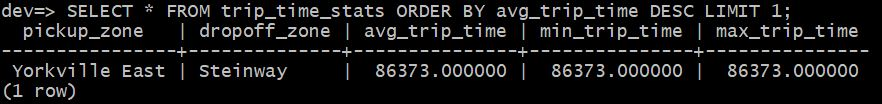
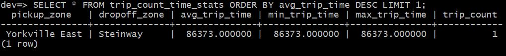
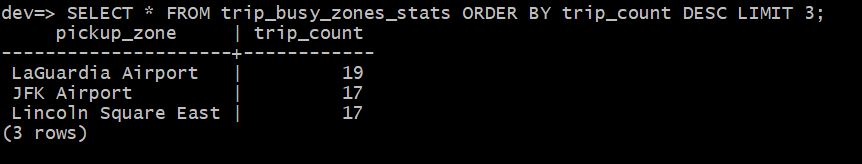

**Stream processing in SQL with RisingWave - Homework**

During this interactive workshop, I gained proficiency in handling real-time streaming data with SQL within the RisingWave environment. RisingWave, an open-source SQL database tailored for processing and overseeing streaming data, was the platform of choice for this learning experience.


**Question 1**

Create a materialized view to compute the average, min and max trip time between each taxi zone.

From this MV, find the pair of taxi zones with the highest average trip time. You may need to use the dynamic filter pattern for this.

Options:
1. **Yorkville East, Steinway**
2. Murray Hill, Midwood
3. East Flatbush/Farragut, East Harlem North
4. Midtown Center, University Heights/Morris Heights

**Query: Create the materialized view for Question 1** 

```

CREATE MATERIALIZED VIEW trip_time_stats AS
SELECT
    tz1.Zone AS pickup_zone,
    tz2.Zone AS dropoff_zone,
    AVG(EXTRACT(EPOCH FROM (tpep_dropoff_datetime - tpep_pickup_datetime))) AS avg_trip_time,
    MIN(EXTRACT(EPOCH FROM (tpep_dropoff_datetime - tpep_pickup_datetime))) AS min_trip_time,
    MAX(EXTRACT(EPOCH FROM (tpep_dropoff_datetime - tpep_pickup_datetime))) AS max_trip_time
FROM
    trip_data td
JOIN
    taxi_zone tz1 ON td.PULocationID = tz1.location_id
JOIN
    taxi_zone tz2 ON td.DOLocationID = tz2.location_id
GROUP BY
    tz1.Zone, tz2.Zone;

```

**Query: Read the data for the materialized view of Question 1** 

```

SELECT * FROM trip_time_stats ORDER BY avg_trip_time DESC LIMIT 1;


```




**Question 2**

Recreate the MV(s) in question 1, to also find the number of trips for the pair of taxi zones with the highest average trip time.

Options:
1. 5
2. 3
3. 10
4. **1**

**Query: Create the materialized view for Question 2** 

```

CREATE MATERIALIZED VIEW trip_count_time_stats AS
SELECT
    tz1.Zone AS pickup_zone,
    tz2.Zone AS dropoff_zone,
    AVG(EXTRACT(EPOCH FROM (tpep_dropoff_datetime - tpep_pickup_datetime))) AS avg_trip_time,
    MIN(EXTRACT(EPOCH FROM (tpep_dropoff_datetime - tpep_pickup_datetime))) AS min_trip_time,
    MAX(EXTRACT(EPOCH FROM (tpep_dropoff_datetime - tpep_pickup_datetime))) AS max_trip_time,
    COUNT(*) AS trip_count
FROM
    trip_data td
JOIN
    taxi_zone tz1 ON td.PULocationID = tz1.location_id
JOIN
    taxi_zone tz2 ON td.DOLocationID = tz2.location_id
GROUP BY
    tz1.Zone, tz2.Zone;

```

**Query: Read the data for the materialized view of Question 2** 

```

SELECT * FROM trip_count_time_stats ORDER BY avg_trip_time DESC LIMIT 1;

```




**Question 3**

From the latest pickup time to 17 hours before, what are the top 3 busiest zones in terms of number of pickups? For example if the latest pickup time is 2020-01-01 12:00:00, then the query should return the top 3 busiest zones from 2020-01-01 11:00:00 to 2020-01-01 12:00:00.

NOTE: For this question 17 hours was picked to ensure we have enough data to work with.

Options:

1. Clinton East, Upper East Side North, Penn Station
2. LaGuardia Airport, Lincoln Square East, JFK Airport
3. Midtown Center, Upper East Side South, Upper East Side North
4. LaGuardia Airport, Midtown Center, Upper East Side North

**Query: Create the materialized view for Question 1** 

```

CREATE MATERIALIZED VIEW trip_busy_zones_stats AS
SELECT
    tz.Zone AS pickup_zone,
    COUNT(*) AS trip_count
FROM
    trip_data td
JOIN
    taxi_zone tz ON td.PULocationID = tz.location_id

WHERE
    tpep_pickup_datetime >= (SELECT MAX(tpep_pickup_datetime) - INTERVAL '17 hours' FROM trip_data)
    
    
GROUP BY
    tz.Zone;

```

**Query: Read the data for the materialized view of Question 1** 

```

SELECT * FROM trip_busy_zones_stats ORDER BY trip_count DESC LIMIT 3;

```



