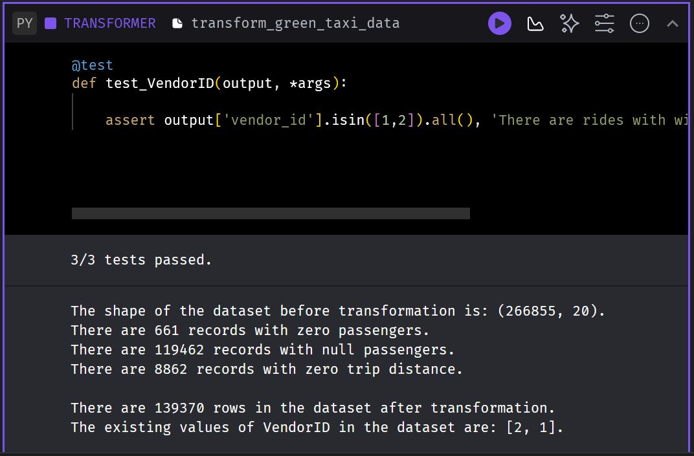
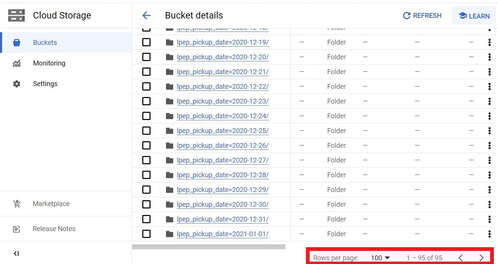

# Week 2: Workflow Orchestration Homework
*Source: The homework is related to Data Engineering Zoomcamp by DataTalksClub.*

*In case you don't get one option exactly, select the closest one*

For the homework, we'll be working with the *green* taxi dataset located here:
https://github.com/DataTalksClub/nyc-tlc-data/releases/tag/green/download
## Assignment
The goal will be to construct an ETL pipeline that loads the data, performs some transformations, and writes the data to a database and Google Cloud Storage (Data Lake).

- Create a new pipeline, call it green_taxi_etl
- Add a data loader block and use Pandas to read data for the final quarter of 2020 (months 10, 11, 12).
  - You can use the same datatypes and date parsing methods shown in the course.
  - BONUS: load the final three months using a for loop and pd.concat
- Add a transformer block and perform the following:
  - Remove rows where the passenger count is equal to 0 *or* the trip distance is equal to zero.
  - Create a new column lpep_pickup_date by converting lpep_pickup_datetime to a date.
  - Rename columns in Camel Case to Snake Case, e.g. VendorID to vendor_id.
  - Add three assertions:
    - vendor_id is one of the existing values in the column (currently)
    - passenger_count is greater than 0
    - trip_distance is greater than 0
- Using a Postgres data exporter (SQL or Python), write the dataset to a table called green_taxi in a schema mage. Replace the table if it already exists.
- Write your data as Parquet files to a bucket in GCP, partioned by lpep_pickup_date. Use the pyarrow library!
- Schedule your pipeline to run daily at 5AM UTC.
## Questions
### Question 1. Data Loading
Once the dataset is loaded, what's the shape of the data?
- **266,855 rows x 20 columns**
- 544,898 rows x 18 columns
- 544,898 rows x 20 columns
- 133,744 rows x 20 columns

> df.shape in Pandas returns a tuple representing the DataFrame's dimensions: the number of rows and columns, respectively.
> code: 
```
print(f"The shape of the dataset before transformation is: {data.shape}.")
```
> output: The shape of the dataset before transformation is: (266855, 20).

### Question 2. Data Transformation
Upon filtering the dataset where the passenger count is greater than 0 *and* the trip distance is greater than zero, how many rows are left?
- 544,897 rows
- 266,855 rows
- **139,370 rows**
- 266,856 rows

> In Python, len(df) returns the number of rows in a DataFrame df.
> code: 
```
print(f"There are {len(data)} rows in the dataset after transformation.")
```
> output: There are 139370 rows in the dataset after transformation.

### Question 3. Data Transformation
Which of the following creates a new column lpep_pickup_date by converting lpep_pickup_datetime to a date?
- data = data['lpep_pickup_datetime'].date
- data('lpep_pickup_date') = data['lpep_pickup_datetime'].date
- **data['lpep_pickup_date'] = data['lpep_pickup_datetime'].dt.date**
- data['lpep_pickup_date'] = data['lpep_pickup_datetime'].dt().date()


> In Python, dt.date is used to extract the date part from a datetime column in a pandas DataFrame.


### Question 4. Data Transformation
What are the existing values of VendorID in the dataset?
- 1, 2, or 3
- **1 or 2**
- 1, 2, 3, 4
- 1

> code:
```
  VendorID_values = pd.unique(data['VendorID']).tolist()
  print(f"The existing values of VendorID in the dataset are: {VendorID_values}.")
```
> output:
>   The existing values of VendorID in the dataset are: [2, 1].


> Screenshot of the output for questions 1, 2, and 4.

### Question 5. Data Transformation
How many columns need to be renamed to snake case?

- 3
- 6
- 2
- **4**


> There are four columns (VendorID, RatecodeID, PULocationID and DOLocationID) that needs to be renamed.
> code:
```
  data.columns = (data.columns
                  .str.replace('ID','_id')
                  .str.replace('PU','pu_')
                  .str.replace('DO','do_')
                  .str.lower()
  )
```

### Question 6. Data Exporting
Once exported, how many partitions (folders) are present in Google Cloud?
- **96**
- 56
- 67
- 108

> After exporting data to GCS, the number of partitions present in the Google Cloud (as shown in the following screenshot) was 95.
> By the instruction at the start of the homework "In case you don't get one option exactly, select the closest one." That is why I have to choose the option 96.


> Screenshot of the number of partitions present in the Google Cloud.